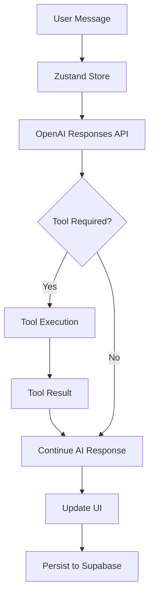
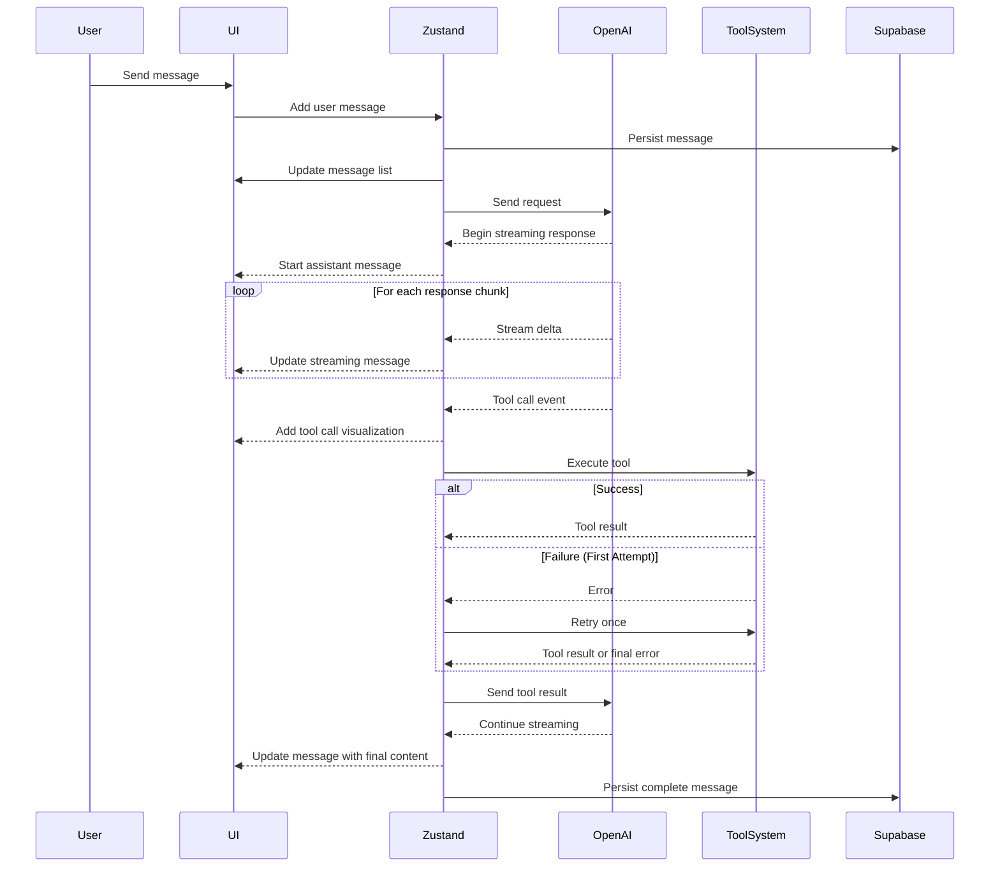

# AI Architecture for Sword Travel

## Overview

This document details the AI architecture for Sword Travel, focusing on the implementation of an agentic, tool-using AI assistant that helps users plan and manage their travel experiences. The system leverages OpenAI's Responses API with GPT-4o-mini, Duffel for travel functionality, and integrates with our Zustand-Supabase state management architecture.

## Core Architecture Components

### 1. AI Agent System



### 2. Tool Library Structure

The AI interacts with a growing library of tools to perform specific actions:

```typescript
interface ToolRegistry {
  [toolName: string]: {
    definition: OpenAITool;     // Tool definition for OpenAI
    executor: ToolExecutor;     // Function to execute the tool
    component: React.FC<any>;   // UI component to render results
    retryConfig: RetryConfig;   // Configuration for retries
  }
}

type ToolExecutor = (args: any) => Promise<any>;

interface RetryConfig {
  maxRetries: number;           // Default: 1 as per requirements
  retryDelay: number;           // Milliseconds between retries
  shouldRetry: (error: any) => boolean; // Custom logic for retriable errors
}
```

## Response Streaming & Tool Calling Flow

### 1. Conversation Flow



### 2. Detailed Implementation

```typescript
// Streaming response handling
async function handleOpenAIStream(
  stream: AsyncIterable<OpenAIStreamEvent>,
  messageId: string
): Promise<void> {
  const store = useSessionChatStore.getState();
  
  for await (const event of stream) {
    switch (event.type) {
      case "response.output_text.delta":
        // Regular text streaming
        store.updateStreamingMessage(messageId, {
          content: (store.getMessageById(messageId)?.content || "") + event.delta.text
        });
        break;
        
      case "response.output_item.added":
        if (event.item?.type === "function_call") {
          // Tool call visualization and execution
          await handleToolCall(messageId, event.item, event.response_id);
        }
        break;
        
      // Handle other event types
    }
  }
  
  // Finalize message after stream completes
  store.finalizeStreamingMessage(messageId);
}

// Tool call handling
async function handleToolCall(
  messageId: string,
  toolCall: OpenAIToolCall,
  responseId: string
): Promise<void> {
  const store = useSessionChatStore.getState();
  
  // Add tool call visualization to UI
  store.updateStreamingMessage(messageId, {
    toolCalls: [...(store.getMessageById(messageId)?.toolCalls || []), {
      id: toolCall.id,
      name: toolCall.name,
      arguments: toolCall.arguments,
      status: "pending"
    }]
  });
  
  // Execute tool with retry logic
  const result = await executeToolWithRetry(toolCall.name, JSON.parse(toolCall.arguments));
  
  // Update UI with result
  store.updateToolCall(messageId, toolCall.id, {
    output: result,
    status: result.error ? "error" : "complete"
  });
  
  // Send result back to OpenAI
  await openai.responses.create({
    previous_response_id: responseId,
    input: [{
      type: "function_call_output",
      call_id: toolCall.call_id,
      output: JSON.stringify(result)
    }]
  });
}
```

## Interactive Tool Cards

For interactive tool cards, we implement a component architecture that allows users to modify search parameters and rerun queries:

```typescript
// Base interactive tool card
const InteractiveTool: React.FC<{
  toolCall: ToolCall;
  result: any;
  onUpdate: (newParams: any) => Promise<void>;
}> = ({ toolCall, result, onUpdate }) => {
  // Common interactive card functionality
};

// Flight search specific card
const FlightSearchCard: React.FC<FlightSearchProps> = (props) => {
  const [searchParams, setSearchParams] = useState(props.initialParams);
  
  // Enable users to modify search parameters
  const handleParamChange = (field: string, value: any) => {
    setSearchParams({...searchParams, [field]: value});
  };
  
  // Allow user to rerun search with new parameters
  const handleRerun = async () => {
    await props.onUpdate(searchParams);
  };
  
  return (
    <Card>
      {/* Search parameters form */}
      <Form>
        <DatePicker 
          label="Departure Date" 
          value={searchParams.departureDate}
          onChange={(date) => handleParamChange('departureDate', date)}
        />
        {/* Other parameters */}
        <Button onClick={handleRerun}>Update Search</Button>
      </Form>
      
      {/* Results display */}
      {props.loading ? (
        <LoadingIndicator />
      ) : (
        <FlightResultsList results={props.results} />
      )}
    </Card>
  );
};
```

## Tool Library Implementation

### 1. Duffel API Integration

```typescript
// Flight search tool
const flightSearchTool: OpenAITool = {
  type: "function",
  name: "search_flights",
  description: "Search for flights between locations with Duffel API",
  parameters: {
    type: "object",
    properties: {
      origin: { type: "string", description: "Origin airport code" },
      destination: { type: "string", description: "Destination airport code" },
      departureDate: { type: "string", description: "Departure date (YYYY-MM-DD)" },
      returnDate: { type: "string", description: "Return date (YYYY-MM-DD)" },
      passengerCount: { type: "integer", default: 1 },
      cabinClass: { 
        type: "string", 
        enum: ["economy", "premium_economy", "business", "first"],
        default: "economy"
      }
    },
    required: ["origin", "destination", "departureDate"]
  },
  strict: true
};

// Flight search executor
const flightSearchExecutor: ToolExecutor = async (args) => {
  try {
    const duffelClient = new Duffel(process.env.DUFFEL_API_KEY);
    
    // Search for offers
    const offerRequest = await duffelClient.offerRequests.create({
      slices: [
        {
          origin: args.origin,
          destination: args.destination,
          departure_date: args.departureDate
        },
        // Add return slice if returnDate provided
        ...(args.returnDate ? [{
          origin: args.destination,
          destination: args.origin,
          departure_date: args.returnDate
        }] : [])
      ],
      passengers: [{
        type: 'adult',
        // Add more passenger types if needed
      }],
      cabin_class: args.cabinClass || 'economy'
    });
    
    // Get offers from offer request
    const offers = await duffelClient.offers.list({
      offer_request_id: offerRequest.data.id,
      limit: 10 // Reasonable default
    });
    
    return {
      offers: offers.data.map(formatOffer),
      metadata: {
        totalResults: offers.meta.total,
        currency: offers.data[0]?.total_currency
      }
    };
  } catch (error) {
    console.error('Flight search error:', error);
    return {
      error: {
        message: error.message,
        code: error.code
      }
    };
  }
};
```

### 2. Hotel Search Implementation

```typescript
// Hotel search tool
const hotelSearchTool: OpenAITool = {
  type: "function",
  name: "search_hotels",
  description: "Search for hotels in a specific location",
  parameters: {
    type: "object",
    properties: {
      location: { type: "string", description: "City or area to search for hotels" },
      checkIn: { type: "string", description: "Check-in date (YYYY-MM-DD)" },
      checkOut: { type: "string", description: "Check-out date (YYYY-MM-DD)" },
      guests: { type: "integer", default: 2 },
      rooms: { type: "integer", default: 1 },
      priceRange: {
        type: "object",
        properties: {
          min: { type: "number" },
          max: { type: "number" }
        }
      },
      amenities: {
        type: "array",
        items: {
          type: "string",
          enum: ["pool", "spa", "gym", "restaurant", "free_wifi", "parking"]
        }
      }
    },
    required: ["location", "checkIn", "checkOut"]
  },
  strict: true
};

// Hotel search executor implementation would connect to appropriate APIs
```

## Rate Limiting Strategy

**Recommendation: Implement a Token Bucket Rate Limiter**

```typescript
// Token bucket implementation for API rate limiting
class TokenBucket {
  private tokens: number;
  private lastRefill: number;
  private readonly capacity: number;
  private readonly refillRate: number; // tokens per ms
  
  constructor(capacity: number, refillRatePerSecond: number) {
    this.tokens = capacity;
    this.capacity = capacity;
    this.refillRate = refillRatePerSecond / 1000;
    this.lastRefill = Date.now();
  }
  
  async consume(tokens: number = 1): Promise<boolean> {
    this.refill();
    
    if (this.tokens >= tokens) {
      this.tokens -= tokens;
      return true;
    }
    
    // Wait for tokens if needed
    const waitTime = Math.ceil((tokens - this.tokens) / this.refillRate);
    await new Promise(resolve => setTimeout(resolve, waitTime));
    this.refill();
    this.tokens -= tokens;
    return true;
  }
  
  private refill() {
    const now = Date.now();
    const elapsed = now - this.lastRefill;
    const newTokens = elapsed * this.refillRate;
    
    if (newTokens > 0) {
      this.tokens = Math.min(this.capacity, this.tokens + newTokens);
      this.lastRefill = now;
    }
  }
}

// Usage with Duffel API
const duffelRateLimiter = new TokenBucket(10, 5); // 10 tokens, 5 per second

async function rateLimitedApiCall(apiFunc: Function, ...args: any[]) {
  await duffelRateLimiter.consume();
  return apiFunc(...args);
}
```

This approach:
1. Prevents API rate limit errors
2. Queues requests when limits are approached
3. Provides predictable performance
4. Is configurable based on provider limits

## Itinerary Integration

For itinerary integration, we need a flexible approach that handles the constraints of flight bookings and hotel reservations:

### Flight Blocking Strategy

```typescript
// Tool for blocking travel time in itinerary without specific flights
const blockTravelTimeTool: OpenAITool = {
  type: "function",
  name: "block_travel_time",
  description: "Block time in the itinerary for travel without specifying exact flights",
  parameters: {
    type: "object",
    properties: {
      origin: { type: "string" },
      destination: { type: "string" },
      date: { type: "string", description: "Date (YYYY-MM-DD)" },
      startTime: { type: "string", description: "Approximate departure time (HH:MM)" },
      endTime: { type: "string", description: "Approximate arrival time (HH:MM)" },
      notes: { type: "string" }
    },
    required: ["origin", "destination", "date", "startTime", "endTime"]
  },
  strict: true
};

// For hotels, we can be more specific with reservations
const addHotelToItineraryTool: OpenAITool = {
  type: "function",
  name: "add_hotel_to_itinerary",
  description: "Add a hotel stay to the trip itinerary",
  parameters: {
    type: "object",
    properties: {
      hotelId: { type: "string" },
      hotelName: { type: "string" },
      location: { type: "string" },
      checkIn: { type: "string", description: "Check-in date (YYYY-MM-DD)" },
      checkOut: { type: "string", description: "Check-out date (YYYY-MM-DD)" },
      roomType: { type: "string" },
      price: { type: "number" },
      confirmationNumber: { type: "string" }
    },
    required: ["hotelName", "location", "checkIn", "checkOut"]
  },
  strict: true
};
```

## User Personalization with RAG

For user preference persistence across sessions, we'll implement a RAG (Retrieval-Augmented Generation) system:

```typescript
// User preferences schema in Supabase
interface UserPreferences {
  userId: string;
  travelPreferences: {
    preferredAirlines?: string[];
    preferredCabinClass?: string;
    preferredHotelChains?: string[];
    dietaryRestrictions?: string[];
    accessibilityNeeds?: string[];
    budgetPreferences?: {
      flights?: string; // "economy", "premium", "luxury"
      accommodations?: string;
      activities?: string;
    };
    travelInterests?: string[]; // "beach", "history", "food", etc.
  };
  pastBookings: Array<{
    type: 'flight' | 'hotel' | 'activity';
    details: any;
    date: string;
    rating?: number;
    feedback?: string;
  }>;
  searchHistory: Array<{
    type: string;
    query: any;
    timestamp: string;
  }>;
}

// RAG implementation for retrieving user preferences
async function getUserContextForRAG(userId: string): Promise<string> {
  // Fetch user preferences from Supabase
  const { data: preferences } = await supabase
    .from('user_preferences')
    .select('*')
    .eq('user_id', userId)
    .single();
    
  if (!preferences) return "";
  
  // Create a natural language representation of preferences
  return `
User Travel Preferences:
- Preferred Airlines: ${preferences.travelPreferences.preferredAirlines?.join(', ') || 'No specific preferences'}
- Usual Cabin Class: ${preferences.travelPreferences.preferredCabinClass || 'No specific preference'}
- Preferred Hotel Chains: ${preferences.travelPreferences.preferredHotelChains?.join(', ') || 'No specific preferences'}
- Dietary Restrictions: ${preferences.travelPreferences.dietaryRestrictions?.join(', ') || 'None specified'}
- Accessibility Needs: ${preferences.travelPreferences.accessibilityNeeds?.join(', ') || 'None specified'}
- Budget Preferences: ${JSON.stringify(preferences.travelPreferences.budgetPreferences || {})}
- Travel Interests: ${preferences.travelPreferences.travelInterests?.join(', ') || 'None specified'}

Recent Travel History:
${preferences.pastBookings?.slice(0, 3).map(booking => `- ${booking.type}: ${JSON.stringify(booking.details)}`).join('\n') || 'No recent bookings'}
  `;
}

// Integrate with OpenAI call
async function sendMessageWithUserContext(userMessage: string, userId: string, sessionId: string) {
  const userContext = await getUserContextForRAG(userId);
  
  // Create system prompt with user context
  const systemPrompt = `
${TRAVEL_ASSISTANT_INSTRUCTIONS}

USER CONTEXT:
${userContext}
  `;
  
  // Make OpenAI call with context
  const response = await openai.responses.create({
    model: "gpt-4o-mini",
    input: [
      { role: "developer", content: systemPrompt },
      ...getConversationHistory(sessionId),
      { role: "user", content: userMessage }
    ],
    tools: toolRegistry.getDefinitions(),
    store: true
  });
  
  // Rest of processing remains the same
}
```

## Error Handling Strategy

```typescript
// Comprehensive error handling with retries
async function executeToolWithRetry(
  toolName: string, 
  args: any, 
  options: { maxRetries?: number } = {}
): Promise<any> {
  const maxRetries = options.maxRetries ?? 1; // Default to 1 retry as per requirements
  let attempts = 0;
  let lastError: any;
  
  while (attempts <= maxRetries) {
    try {
      attempts++;
      return await toolRegistry.execute(toolName, args);
    } catch (error) {
      lastError = error;
      console.warn(`Tool execution failed (attempt ${attempts}/${maxRetries + 1}):`, error);
      
      // Don't wait after the last attempt
      if (attempts <= maxRetries) {
        // Exponential backoff
        const backoffMs = Math.min(1000 * Math.pow(2, attempts - 1), 8000);
        await new Promise(resolve => setTimeout(resolve, backoffMs));
      }
    }
  }
  
  // All attempts failed
  return {
    error: {
      message: lastError.message,
      code: lastError.code || 'EXECUTION_FAILED',
      attempts
    }
  };
}
```

## State Management Architecture

The AI system integrates with our Zustand-Supabase architecture:

```typescript
// In session-chat-store.ts
export const useSessionChatStore = create<SessionChatState>((set, get) => ({
  // Message state
  messages: [],
  streamingMessage: null,
  isLoadingMessages: false,
  messageError: null,
  hasMoreMessages: true,
  
  // AI state
  aiContext: {
    activeTools: [], // Currently executing tools
    toolHistory: [],  // Record of tool executions
    pendingToolCalls: [], // Tools waiting to be executed
  },
  
  // Core methods
  sendUserMessage: async (content: string, sessionId: string) => {
    // Add user message to state
    const userMessageId = generateUniqueId();
    set(state => ({
      messages: [...state.messages, {
        id: userMessageId,
        session_id: sessionId,
        content,
        role: 'user',
        timestamp: new Date().toISOString(),
        user_id: get().currentUser?.id,
        user_display_name: get().currentUser?.displayName
      }]
    }));
    
    // Persist to Supabase
    await supabase
      .from('chat_messages')
      .insert({
        id: userMessageId,
        session_id: sessionId,
        content,
        role: 'user',
        user_id: get().currentUser?.id,
        user_display_name: get().currentUser?.displayName
      });
    
    // Generate AI response
    await handleAIResponse(content, sessionId);
  },
  
  // Methods for managing streaming responses
  updateStreamingMessage: (messageId: string, update: Partial<ChatMessage>) => {
    set(state => {
      if (!state.streamingMessage || state.streamingMessage.id !== messageId) {
        return state;
      }
      
      return {
        streamingMessage: {
          ...state.streamingMessage,
          ...update,
          // Merge nested objects like toolCalls
          toolCalls: update.toolCalls || state.streamingMessage.toolCalls
        }
      };
    });
  },
  
  // Tool call management
  updateToolCall: (messageId: string, toolCallId: string, update: Partial<ToolCall>) => {
    set(state => {
      // Find the message
      const message = state.streamingMessage?.id === messageId 
        ? state.streamingMessage 
        : state.messages.find(m => m.id === messageId);
        
      if (!message || !message.toolCalls) return state;
      
      // Update the specific tool call
      const updatedToolCalls = message.toolCalls.map(tc => 
        tc.id === toolCallId ? { ...tc, ...update } : tc
      );
      
      // Update either streaming message or regular message
      if (state.streamingMessage?.id === messageId) {
        return {
          streamingMessage: {
            ...state.streamingMessage,
            toolCalls: updatedToolCalls
          }
        };
      } else {
        return {
          messages: state.messages.map(m => 
            m.id === messageId ? { ...m, toolCalls: updatedToolCalls } : m
          )
        };
      }
    });
  },
  
  // Finalize streaming messages and persist to Supabase
  finalizeStreamingMessage: async (messageId: string) => {
    const { streamingMessage } = get();
    if (!streamingMessage || streamingMessage.id !== messageId) return;
    
    // Move from streaming to regular messages
    set(state => ({
      messages: [...state.messages, {
        ...state.streamingMessage!,
        streamingStatus: { isStreaming: false }
      }],
      streamingMessage: null
    }));
    
    // Persist to Supabase
    await supabase
      .from('chat_messages')
      .insert({
        id: streamingMessage.id,
        session_id: streamingMessage.session_id,
        content: streamingMessage.content,
        role: streamingMessage.role,
        tool_calls: streamingMessage.toolCalls ? JSON.stringify(streamingMessage.toolCalls) : null,
        processing_metadata: streamingMessage.processingMetadata ? JSON.stringify(streamingMessage.processingMetadata) : null
      });
  }
}));
```

## Future Enhancements

1. **Context Window Optimization**: Implement semantic compression of chat history to maximize the effective context window
2. **Multi-modal Interactions**: Add support for image inputs (e.g., photos of destinations, documents)
3. **Predictive Assistance**: Anticipate user needs based on their itinerary and current location
4. **Cross-session Memory**: Enhance RAG system to remember key decisions and preferences across multiple planning sessions
5. **Parallel Tool Execution**: Process multiple tools simultaneously for complex queries
6. **Custom Tool Creation**: Allow power users to define custom tools for their specific travel needs

## Conclusion

This architecture provides a comprehensive framework for implementing an agentic, tool-using AI assistant in Sword Travel. By leveraging the OpenAI Responses API, Duffel integration, and our Zustand-Supabase architecture, we can create a powerful, conversational experience that helps users plan and manage their travel with ease.
