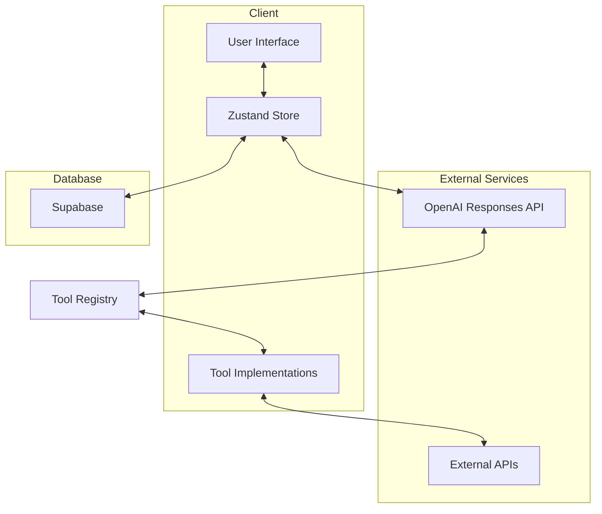
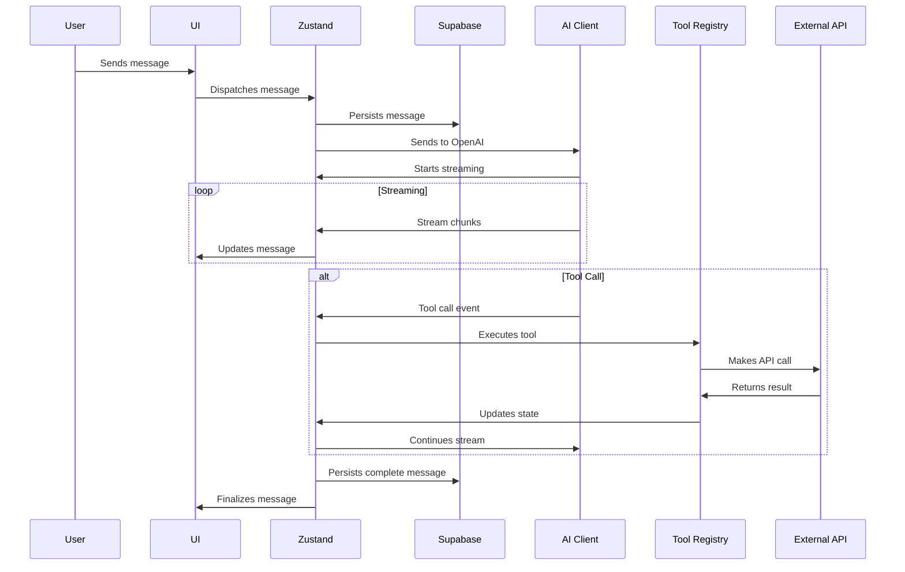
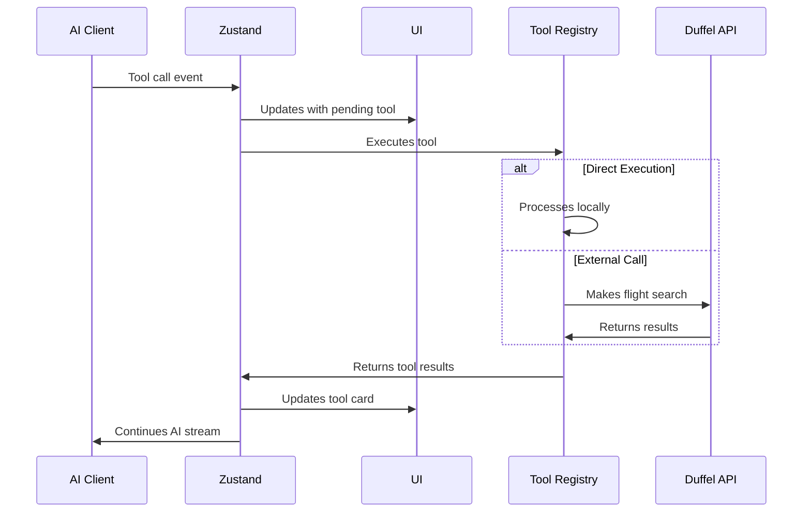

# Core AI Architecture

## Overview

The Sword Travel AI system uses OpenAI's GPT-4o-mini model through the Responses API to create an agentic travel assistant. This assistant can help users plan trips, search for flights and hotels, and manage their travel itineraries through a conversational interface with interactive tool components.

## System Architecture



## Core Components

### 1. AI Communication Layer

The AI Communication Layer handles all interactions with the OpenAI Responses API:

```typescript
// src/lib/ai/openai-client.ts
import { OpenAI } from 'openai';

// Initialize with environment variables
const openai = new OpenAI({
  apiKey: process.env.OPENAI_API_KEY
});

export interface AIRequestOptions {
  input: Array<{
    role: 'user' | 'assistant' | 'developer';
    content: string;
    name?: string;
  }>;
  tools?: OpenAITool[];
  stream?: boolean;
  model?: string;
  store?: boolean;
  previous_response_id?: string;
}

export async function sendAIRequest(options: AIRequestOptions) {
  const model = options.model || 'gpt-4o-mini';
  
  return openai.responses.create({
    model,
    input: options.input,
    tools: options.tools,
    stream: options.stream,
    store: options.store,
    previous_response_id: options.previous_response_id
  });
}

export async function* streamAIResponse(options: AIRequestOptions) {
  if (!options.stream) {
    options.stream = true;
  }
  
  return openai.responses.create({
    model: options.model || 'gpt-4o-mini',
    input: options.input,
    tools: options.tools,
    stream: true,
    store: options.store,
    previous_response_id: options.previous_response_id
  });
}
```

### 2. Tool Registry

The Tool Registry manages all available tools and their implementations:

```typescript
// src/lib/ai/tool-registry.ts
import { OpenAITool } from '../../types/chat';

export interface ToolExecutor {
  (args: any): Promise<any>;
}

export interface ToolDefinition {
  definition: OpenAITool;
  executor: ToolExecutor;
  component: React.FC<any>;
  retryConfig: RetryConfig;
}

export interface RetryConfig {
  maxRetries: number;
  retryDelay: number;
  shouldRetry: (error: any) => boolean;
}

class ToolRegistry {
  private tools: Record<string, ToolDefinition> = {};
  
  registerTool(name: string, definition: ToolDefinition) {
    this.tools[name] = definition;
  }
  
  getTool(name: string): ToolDefinition | undefined {
    return this.tools[name];
  }
  
  getAllDefinitions(): OpenAITool[] {
    return Object.values(this.tools).map(tool => tool.definition);
  }
  
  async executeTool(name: string, args: any): Promise<any> {
    const tool = this.getTool(name);
    if (!tool) {
      throw new Error(`Tool not found: ${name}`);
    }
    
    return tool.executor(args);
  }
}

// Create global tool registry instance
export const toolRegistry = new ToolRegistry();

// Register core tools
import { registerFlightTools } from './tools/flight-tools';
import { registerHotelTools } from './tools/hotel-tools';
import { registerItineraryTools } from './tools/itinerary-tools';

export function initializeToolRegistry() {
  registerFlightTools(toolRegistry);
  registerHotelTools(toolRegistry);
  registerItineraryTools(toolRegistry);
}
```

### 3. Message Processing Engine

The Message Processing Engine handles the flow of messages and tool calls:

```typescript
// src/lib/ai/message-processor.ts
import { OpenAIStreamEvent } from '../../types/chat';
import { sendAIRequest, streamAIResponse } from './openai-client';
import { toolRegistry } from './tool-registry';
import { useSessionChatStore } from '../../store/session-chat-store';

export async function processUserMessage(message: string, sessionId: string) {
  const store = useSessionChatStore.getState();
  
  // 1. Add user message to store
  await store.addUserMessage(message, sessionId);
  
  // 2. Create assistant message placeholder for streaming
  const assistantMessageId = generateUniqueId();
  store.addStreamingMessage({
    id: assistantMessageId,
    session_id: sessionId,
    role: 'assistant',
    content: '',
    timestamp: new Date().toISOString(),
    streamingStatus: { isStreaming: true }
  });
  
  try {
    // 3. Stream response from AI
    const stream = await streamAIResponse({
      input: [
        { 
          role: 'developer', 
          content: TRAVEL_ASSISTANT_INSTRUCTIONS 
        },
        ...getConversationHistory(sessionId),
        { role: 'user', content: message }
      ],
      tools: toolRegistry.getAllDefinitions(),
      store: true
    });
    
    // 4. Process streaming events
    for await (const event of stream) {
      await handleStreamEvent(event, assistantMessageId, stream.responseId);
    }
    
    // 5. Finalize message
    store.finalizeStreamingMessage(assistantMessageId);
  } catch (error) {
    console.error('Error processing message:', error);
    store.updateStreamingMessage(assistantMessageId, {
      content: 'I encountered an error. Please try again.',
      streamingStatus: { isStreaming: false, error: error.message }
    });
  }
}

// Handle individual stream events
async function handleStreamEvent(
  event: OpenAIStreamEvent,
  messageId: string,
  responseId: string
) {
  const store = useSessionChatStore.getState();
  
  switch (event.type) {
    case "response.output_text.delta":
      // Update streaming message with text delta
      store.updateStreamingMessage(messageId, {
        content: (store.getMessageById(messageId)?.content || '') + event.delta.text
      });
      break;
      
    case "response.output_item.added":
      if (event.item?.type === "function_call") {
        // Handle tool call
        await handleToolCall(event.item, messageId, responseId);
      }
      break;
  }
}

// Handle tool calls
async function handleToolCall(
  toolCall: any,
  messageId: string,
  responseId: string
) {
  const store = useSessionChatStore.getState();
  
  // 1. Add tool call to message
  store.updateStreamingMessage(messageId, {
    toolCalls: [...(store.getMessageById(messageId)?.toolCalls || []), {
      id: toolCall.id,
      name: toolCall.name,
      arguments: toolCall.arguments,
      status: 'pending'
    }]
  });
  
  try {
    // 2. Execute tool
    const result = await executeToolWithRetry(
      toolCall.name,
      JSON.parse(toolCall.arguments)
    );
    
    // 3. Update tool call with result
    store.updateToolCall(messageId, toolCall.id, {
      output: result,
      status: 'complete'
    });
    
    // 4. Send result back to continue the stream
    await sendAIRequest({
      previous_response_id: responseId,
      input: [{
        type: 'function_call_output',
        call_id: toolCall.call_id,
        output: JSON.stringify(result)
      }]
    });
  } catch (error) {
    // Handle tool execution error
    console.error(`Tool execution error (${toolCall.name}):`, error);
    
    store.updateToolCall(messageId, toolCall.id, {
      error: error.message,
      status: 'error'
    });
    
    // Let the AI know about the failure
    await sendAIRequest({
      previous_response_id: responseId,
      input: [{
        type: 'function_call_output',
        call_id: toolCall.call_id,
        output: JSON.stringify({ error: error.message })
      }]
    });
  }
}
```

## Data Flows

### 1. User Message Processing Flow



### 2. Tool Execution Flow



## Development Considerations

### 1. TypeScript Integration

All components are fully typed with TypeScript interfaces for:
- Message objects
- Tool definitions and results
- Stream events
- State changes

### 2. Next.js Architecture

The implementation follows Next.js best practices:
- API routes for OpenAI proxy to protect API keys
- Server components for data fetching
- Client components for interactivity
- Proper environment variable handling

### 3. Security Considerations

- API keys are stored as environment variables
- User data is properly validated and sanitized
- Rate limiting is implemented to prevent abuse
- Error handling reveals minimal information to users

### 4. Testing Strategy

- Unit tests for tool implementations
- Integration tests for AI response processing
- End-to-end tests for complete conversation flows
- Mock implementations for external services

## Configuration

### 1. Environment Variables

```bash
# OpenAI Configuration
OPENAI_API_KEY=sk-xxx
OPENAI_MODEL=gpt-4o-mini

# Duffel API Configuration
DUFFEL_API_KEY=duffel_test_xxx
DUFFEL_ENVIRONMENT=test # or 'live'

# Other API keys
GOOGLE_MAPS_API_KEY=xxx
```

### 2. Feature Flags

```typescript
// src/config/feature-flags.ts
export const AI_FEATURES = {
  FLIGHT_SEARCH: true,
  HOTEL_SEARCH: true,
  INTERACTIVE_TOOLS: true,
  PARALLEL_TOOL_EXECUTION: true,
  USER_PREFERENCE_RAG: false, // Coming soon
  MULTI_MODAL_INPUT: false,   // Coming soon
};
```
