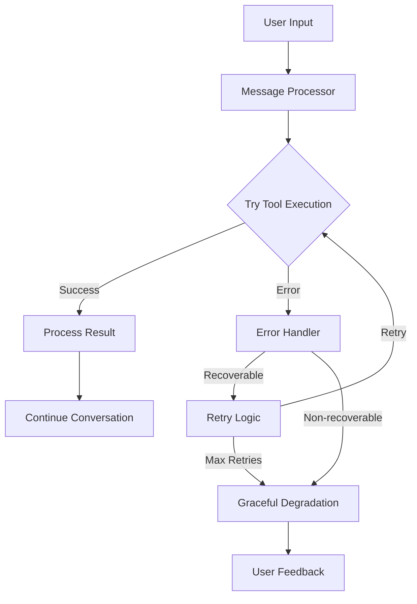
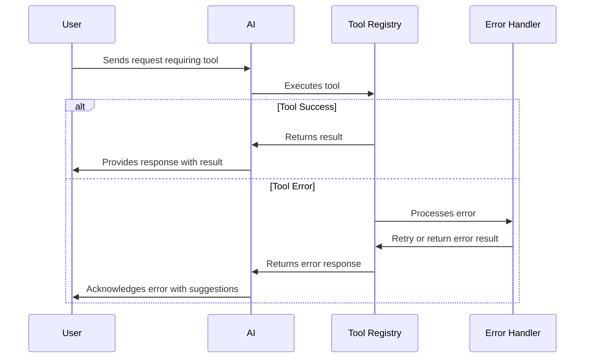

# Error Handling

## Overview

Robust error handling is critical for the Sword Travel AI assistant to maintain a resilient user experience. This document outlines our error handling strategies for API calls, tool execution, and user interactions.

## Error Handling Architecture



## Retry Strategy

We implement a configurable retry strategy for all external API calls:

```typescript
// src/lib/ai/error/retry.ts
interface RetryOptions {
  maxRetries: number;
  initialDelay: number;
  maxDelay: number;
  backoffFactor: number;
  shouldRetry: (error: any) => boolean;
}

export async function withRetry<T>(
  operation: () => Promise<T>,
  options: Partial<RetryOptions> = {}
): Promise<T> {
  const config: RetryOptions = {
    maxRetries: 3,
    initialDelay: 300,
    maxDelay: 3000,
    backoffFactor: 2,
    shouldRetry: (error) => {
      // Default retry conditions
      if (error.status === 429) return true; // Rate limiting
      if (error.status >= 500) return true;  // Server errors
      if (error.message?.includes('timeout')) return true;
      if (error.message?.includes('network')) return true;
      return false;
    },
    ...options
  };
  
  let lastError: any;
  let attempt = 0;
  
  while (attempt <= config.maxRetries) {
    try {
      return await operation();
    } catch (error) {
      lastError = error;
      attempt++;
      
      // Check if we should retry
      if (attempt > config.maxRetries || !config.shouldRetry(error)) {
        break;
      }
      
      // Calculate delay with exponential backoff
      const delay = Math.min(
        config.initialDelay * Math.pow(config.backoffFactor, attempt - 1),
        config.maxDelay
      );
      
      // Add jitter to prevent thundering herd
      const jitteredDelay = delay * (0.8 + Math.random() * 0.4);
      
      console.warn(
        `Attempt ${attempt}/${config.maxRetries} failed. Retrying in ${Math.round(jitteredDelay)}ms`,
        error
      );
      
      // Wait before retrying
      await new Promise(resolve => setTimeout(resolve, jitteredDelay));
    }
  }
  
  // All retries failed
  throw lastError;
}
```

## Tool Execution Error Handling

We implement specific error handling for each tool type:

```typescript
// src/lib/ai/error/tool-error-handler.ts
import { ToolCall } from '../../../types/chat';
import { withRetry } from './retry';
import { toolRegistry } from '../tool-registry';

export interface ToolErrorContext {
  toolName: string;
  args: any;
  error: any;
  attemptCount: number;
}

export interface ToolErrorHandler {
  canHandle: (context: ToolErrorContext) => boolean;
  handle: (context: ToolErrorContext) => Promise<any>;
}

// Registry of tool-specific error handlers
const errorHandlers: Record<string, ToolErrorHandler[]> = {};

// Register a handler for a specific tool
export function registerToolErrorHandler(
  toolName: string,
  handler: ToolErrorHandler
) {
  if (!errorHandlers[toolName]) {
    errorHandlers[toolName] = [];
  }
  
  errorHandlers[toolName].push(handler);
}

// Execute a tool with error handling
export async function executeToolWithErrorHandling(
  toolName: string,
  args: any
): Promise<any> {
  const tool = toolRegistry.getTool(toolName);
  
  if (!tool) {
    throw new Error(`Tool not found: ${toolName}`);
  }
  
  // Get retry config from tool definition
  const retryConfig = tool.retryConfig || {
    maxRetries: 1,
    initialDelay: 300,
    shouldRetry: () => true
  };
  
  let attemptCount = 0;
  
  // Execute with retry
  return withRetry(
    async () => {
      attemptCount++;
      
      try {
        return await tool.executor(args);
      } catch (error) {
        // Look for specific handlers for this tool
        const handlers = errorHandlers[toolName] || [];
        
        for (const handler of handlers) {
          const context = { toolName, args, error, attemptCount };
          
          if (handler.canHandle(context)) {
            return await handler.handle(context);
          }
        }
        
        // No handler found, rethrow
        throw error;
      }
    },
    retryConfig
  );
}
```

## Common Error Handlers

We implement handlers for common error scenarios:

```typescript
// src/lib/ai/error/common-handlers.ts
import { ToolErrorContext, ToolErrorHandler, registerToolErrorHandler } from './tool-error-handler';

// API rate limit handler
const rateLimitHandler: ToolErrorHandler = {
  canHandle: (context) => {
    const { error } = context;
    return (
      error.status === 429 ||
      error.message?.includes('rate limit') ||
      error.message?.includes('too many requests')
    );
  },
  
  handle: async (context) => {
    console.warn(`Rate limit hit for ${context.toolName}`, context);
    
    // Return a user-friendly message
    return {
      error: {
        type: 'RATE_LIMIT',
        message: 'We hit a temporary rate limit. Please try again in a few moments.',
        retryAfter: parseInt(context.error.headers?.['retry-after'] || '60')
      }
    };
  }
};

// Authentication error handler
const authErrorHandler: ToolErrorHandler = {
  canHandle: (context) => {
    const { error } = context;
    return (
      error.status === 401 ||
      error.status === 403 ||
      error.message?.includes('unauthorized') ||
      error.message?.includes('authentication')
    );
  },
  
  handle: async (context) => {
    console.error(`Authentication error for ${context.toolName}`, context);
    
    // Return a user-friendly message
    return {
      error: {
        type: 'AUTH_ERROR',
        message: 'There was an authentication problem. Please check your account settings.'
      }
    };
  }
};

// Network error handler
const networkErrorHandler: ToolErrorHandler = {
  canHandle: (context) => {
    const { error } = context;
    return (
      error.name === 'NetworkError' ||
      error.message?.includes('network') ||
      error.message?.includes('internet') ||
      error.message?.includes('timeout')
    );
  },
  
  handle: async (context) => {
    console.warn(`Network error for ${context.toolName}`, context);
    
    return {
      error: {
        type: 'NETWORK_ERROR',
        message: 'There was a network problem. Please check your internet connection.'
      }
    };
  }
};

// Register common handlers for all tools
export function registerCommonErrorHandlers() {
  // Get all tool names
  const allTools = Object.keys(toolRegistry.getAllTools());
  
  // Register handlers for each tool
  allTools.forEach(toolName => {
    registerToolErrorHandler(toolName, rateLimitHandler);
    registerToolErrorHandler(toolName, authErrorHandler);
    registerToolErrorHandler(toolName, networkErrorHandler);
  });
}
```

## Flight Search Error Handling

Example of tool-specific error handlers:

```typescript
// src/lib/ai/error/flight-error-handlers.ts
import { ToolErrorContext, ToolErrorHandler, registerToolErrorHandler } from './tool-error-handler';

// Handle invalid airport codes
const invalidAirportHandler: ToolErrorHandler = {
  canHandle: (context) => {
    const { error, toolName } = context;
    return (
      toolName === 'search_flights' &&
      (error.message?.includes('airport code') ||
       error.message?.includes('invalid origin') ||
       error.message?.includes('invalid destination'))
    );
  },
  
  handle: async (context) => {
    const { args } = context;
    
    console.warn('Invalid airport code error', context);
    
    return {
      success: false,
      error: {
        type: 'INVALID_AIRPORT',
        message: `One or more airport codes are invalid. Please check that ${args.origin} and ${args.destination} are valid airport IATA codes.`
      },
      searchParams: args
    };
  }
};

// Handle no flights found
const noFlightsHandler: ToolErrorHandler = {
  canHandle: (context) => {
    const { error, toolName } = context;
    return (
      toolName === 'search_flights' &&
      (error.message?.includes('no flights') ||
       error.message?.includes('no results'))
    );
  },
  
  handle: async (context) => {
    const { args } = context;
    
    return {
      success: false,
      error: {
        type: 'NO_FLIGHTS',
        message: 'No flights found for this route and date. Try adjusting your search parameters.'
      },
      searchParams: args,
      alternatives: await suggestAlternativeFlights(args)
    };
  }
};

// Function to suggest alternatives
async function suggestAlternativeFlights(originalArgs: any) {
  // Implementation to find alternative dates or nearby airports
  // ...
  
  return {
    alternativeDates: [
      { date: addDays(originalArgs.departureDate, 1), reason: 'Next day' },
      { date: addDays(originalArgs.departureDate, -1), reason: 'Previous day' }
    ],
    alternativeAirports: [
      // Nearby airports based on geography
    ]
  };
}

// Register flight-specific handlers
export function registerFlightErrorHandlers() {
  registerToolErrorHandler('search_flights', invalidAirportHandler);
  registerToolErrorHandler('search_flights', noFlightsHandler);
}
```

## Error Tracking and Analytics

We implement error tracking to identify and fix issues:

```typescript
// src/lib/ai/error/error-tracker.ts
import { supabase } from '../../supabase';

interface ErrorReport {
  toolName?: string;
  functionName?: string;
  errorMessage: string;
  errorStack?: string;
  context?: any;
  userId?: string;
  sessionId?: string;
  timestamp: string;
}

// Track an error for analytics
export async function trackError(error: Error, context: any = {}) {
  try {
    const errorReport: ErrorReport = {
      errorMessage: error.message,
      errorStack: error.stack,
      context,
      timestamp: new Date().toISOString()
    };
    
    // Store in Supabase for analysis
    await supabase
      .from('error_reports')
      .insert(errorReport);
      
    // Could also send to external error tracking service
  } catch (e) {
    // Don't let error tracking failures affect the app
    console.error('Failed to track error:', e);
  }
}

// Analyze error patterns
export async function getErrorPatterns(
  timeframe: 'day' | 'week' | 'month' = 'day'
) {
  try {
    // Calculate date range
    const now = new Date();
    let startDate = new Date(now);
    
    switch (timeframe) {
      case 'day':
        startDate.setDate(now.getDate() - 1);
        break;
      case 'week':
        startDate.setDate(now.getDate() - 7);
        break;
      case 'month':
        startDate.setMonth(now.getMonth() - 1);
        break;
    }
    
    // Query error reports
    const { data, error } = await supabase
      .from('error_reports')
      .select('*')
      .gte('timestamp', startDate.toISOString());
      
    if (error) throw error;
    
    // Group by error type and tool
    const errorsByTool: Record<string, number> = {};
    const errorTypes: Record<string, number> = {};
    
    data.forEach(report => {
      // Count by tool
      const tool = report.toolName || 'unknown';
      errorsByTool[tool] = (errorsByTool[tool] || 0) + 1;
      
      // Count by error message pattern (simplified)
      const errorType = getErrorType(report.errorMessage);
      errorTypes[errorType] = (errorTypes[errorType] || 0) + 1;
    });
    
    return {
      total: data.length,
      byTool: errorsByTool,
      byType: errorTypes
    };
  } catch (e) {
    console.error('Error analyzing error patterns:', e);
    return { total: 0, byTool: {}, byType: {} };
  }
}

// Helper to categorize errors
function getErrorType(message: string): string {
  if (!message) return 'unknown';
  
  if (message.includes('rate limit')) return 'rate_limit';
  if (message.includes('network')) return 'network';
  if (message.includes('timeout')) return 'timeout';
  if (message.includes('authentication')) return 'auth';
  if (message.includes('not found')) return 'not_found';
  
  // Get first few words to group similar errors
  return message.split(' ').slice(0, 3).join('_').toLowerCase();
}
```

## User-Facing Error Messages

We provide consistent, helpful error messages to users:

```typescript
// src/lib/ai/error/user-messages.ts
import { ToolCall } from '../../../types/chat';

export interface ErrorMessageOptions {
  isUserFriendly?: boolean;
  includeActionable?: boolean;
  includeTechnicalDetails?: boolean;
}

// Format error message for display to user
export function formatErrorForUser(
  toolCall: ToolCall,
  options: ErrorMessageOptions = {}
): string {
  const { name, output, error } = toolCall;
  const errorObj = error || (output?.error ? output.error : null);
  
  if (!errorObj) {
    return "I encountered an unknown error. Please try again.";
  }
  
  // Default options
  const opts = {
    isUserFriendly: true,
    includeActionable: true,
    includeTechnicalDetails: false,
    ...options
  };
  
  // User friendly error messages by tool type
  const errorMessages: Record<string, Record<string, string>> = {
    search_flights: {
      INVALID_AIRPORT: "I couldn't find one of the airports you specified. Please check the airport codes.",
      NO_FLIGHTS: "I couldn't find any flights for the route and dates you requested.",
      RATE_LIMIT: "Our flight search is temporarily unavailable due to high demand. Please try again in a minute.",
      DEFAULT: "I had trouble searching for flights."
    },
    search_hotels: {
      LOCATION_NOT_FOUND: "I couldn't find the location you specified for hotel search.",
      NO_AVAILABILITY: "I couldn't find available hotels for your dates.",
      DEFAULT: "I had trouble searching for hotels."
    },
    DEFAULT: {
      DEFAULT: "I encountered an error while processing your request."
    }
  };
  
  // Get tool-specific messages or default
  const toolMessages = errorMessages[name] || errorMessages.DEFAULT;
  
  // Get specific error type or default
  const errorType = errorObj.type || 'DEFAULT';
  const message = toolMessages[errorType] || toolMessages.DEFAULT;
  
  // Actionable suggestions
  let actionableSuggestion = '';
  if (opts.includeActionable) {
    if (name === 'search_flights' && errorType === 'INVALID_AIRPORT') {
      actionableSuggestion = " Try using the 3-letter IATA code (e.g., 'JFK' for New York JFK, 'LAX' for Los Angeles).";
    } else if (name === 'search_flights' && errorType === 'NO_FLIGHTS') {
      actionableSuggestion = " Try searching for different dates or nearby airports.";
    }
  }
  
  // Technical details
  let technicalDetails = '';
  if (opts.includeTechnicalDetails && errorObj.message) {
    technicalDetails = `\n\nTechnical details: ${errorObj.message}`;
  }
  
  return `${message}${actionableSuggestion}${technicalDetails}`;
}

// Generate AI response when a tool fails
export function generateErrorResponse(toolCall: ToolCall): string {
  const { name } = toolCall;
  const errorMessage = formatErrorForUser(toolCall);
  
  // Tool-specific response templates
  const responseTemplates: Record<string, string[]> = {
    search_flights: [
      "I'm sorry, but I encountered an issue while searching for flights. {error}",
      "I wasn't able to complete the flight search. {error}",
      "There was a problem finding flights. {error}"
    ],
    search_hotels: [
      "I had trouble finding hotels based on your criteria. {error}",
      "I wasn't able to complete the hotel search. {error}"
    ]
  };
  
  const templates = responseTemplates[name] || [
    "I'm sorry, but I encountered an issue. {error}",
    "I couldn't complete that operation. {error}"
  ];
  
  // Select random template for variety
  const template = templates[Math.floor(Math.random() * templates.length)];
  
  return template.replace('{error}', errorMessage);
}
```

## Error Recovery Flow

The sequence for handling errors in the application:



## Monitoring and Alerting

We implement monitoring for critical error conditions:

```typescript
// src/lib/ai/error/monitoring.ts
interface ErrorThreshold {
  count: number;
  timeWindowMinutes: number;
  notificationChannels: string[];
}

// Error thresholds by type
const errorThresholds: Record<string, ErrorThreshold> = {
  rate_limit: {
    count: 5,
    timeWindowMinutes: 1,
    notificationChannels: ['slack', 'email']
  },
  auth_error: {
    count: 3,
    timeWindowMinutes: 5,
    notificationChannels: ['slack', 'email']
  },
  critical_error: {
    count: 1,
    timeWindowMinutes: 10,
    notificationChannels: ['slack', 'sms', 'email']
  }
};

// Error counter with time windows
const errorCounts: Record<string, Array<{ timestamp: number }>> = {};

// Check if threshold is exceeded and send alert
function checkErrorThreshold(errorType: string): boolean {
  const threshold = errorThresholds[errorType];
  
  if (!threshold) return false;
  
  // Initialize if needed
  if (!errorCounts[errorType]) {
    errorCounts[errorType] = [];
  }
  
  // Add current error
  const now = Date.now();
  errorCounts[errorType].push({ timestamp: now });
  
  // Remove old errors outside time window
  const timeWindow = threshold.timeWindowMinutes * 60 * 1000;
  errorCounts[errorType] = errorCounts[errorType].filter(
    error => now - error.timestamp <= timeWindow
  );
  
  // Check if threshold is exceeded
  return errorCounts[errorType].length >= threshold.count;
}

// Send alerts if threshold exceeded
export function monitorError(errorType: string, details: any): void {
  if (checkErrorThreshold(errorType)) {
    const threshold = errorThresholds[errorType];
    
    // Send notifications to all channels
    threshold.notificationChannels.forEach(channel => {
      sendAlert(channel, errorType, details);
    });
  }
}

// Send alert to specified channel
function sendAlert(
  channel: string,
  errorType: string,
  details: any
): void {
  switch (channel) {
    case 'slack':
      // Send to Slack webhook
      break;
    case 'email':
      // Send email to admin
      break;
    case 'sms':
      // Send SMS for critical issues
      break;
  }
}
```

## Health Check API

We implement a health check API to monitor system status:

```typescript
// src/pages/api/health/ai.ts
import type { NextApiRequest, NextApiResponse } from 'next';
import { OpenAI } from 'openai';
import { toolRegistry } from '../../../lib/ai/tool-registry';

interface HealthStatus {
  status: 'healthy' | 'degraded' | 'unhealthy';
  services: Record<string, {
    status: 'healthy' | 'degraded' | 'unhealthy';
    latency?: number;
    message?: string;
  }>;
  timestamp: string;
}

export default async function handler(
  req: NextApiRequest,
  res: NextApiResponse<HealthStatus>
) {
  // Overall status starts as healthy
  let overallStatus: 'healthy' | 'degraded' | 'unhealthy' = 'healthy';
  
  // Service checks
  const services: HealthStatus['services'] = {};
  
  // Check OpenAI connectivity
  try {
    const start = Date.now();
    const openai = new OpenAI({ apiKey: process.env.OPENAI_API_KEY });
    await openai.responses.create({
      model: 'gpt-4o-mini',
      input: [{ role: 'user', content: 'health check' }],
      stream: false
    });
    const latency = Date.now() - start;
    
    services.openai = {
      status: latency < 1000 ? 'healthy' : 'degraded',
      latency,
      message: 'OpenAI API is responsive'
    };
  } catch (error) {
    services.openai = {
      status: 'unhealthy',
      message: `OpenAI API error: ${error.message}`
    };
    overallStatus = 'unhealthy';
  }
  
  // Check Duffel API
  try {
    const start = Date.now();
    // Simple health check call to Duffel
    // ...
    const latency = Date.now() - start;
    
    services.duffel = {
      status: 'healthy',
      latency,
      message: 'Duffel API is responsive'
    };
  } catch (error) {
    services.duffel = {
      status: 'unhealthy',
      message: `Duffel API error: ${error.message}`
    };
    
    // Downgrade to degraded if Duffel is down
    if (overallStatus === 'healthy') {
      overallStatus = 'degraded';
    }
  }
  
  // Check Supabase
  try {
    const start = Date.now();
    const { supabase } = await import('../../../lib/supabase');
    const { error } = await supabase.from('health_checks').select('count').limit(1);
    const latency = Date.now() - start;
    
    if (error) throw error;
    
    services.supabase = {
      status: 'healthy',
      latency,
      message: 'Supabase is responsive'
    };
  } catch (error) {
    services.supabase = {
      status: 'unhealthy',
      message: `Supabase error: ${error.message}`
    };
    overallStatus = 'unhealthy';
  }
  
  // Return health status
  res.status(overallStatus === 'unhealthy' ? 500 : 200).json({
    status: overallStatus,
    services,
    timestamp: new Date().toISOString()
  });
}
```

## Degraded Mode

We implement a degraded mode for when external services are down:

```typescript
// src/lib/ai/error/degraded-mode.ts
import { supabase } from '../../supabase';

// Service status cache
interface ServiceStatus {
  isHealthy: boolean;
  lastChecked: number;
  ttlMs: number;
}

const serviceStatusCache: Record<string, ServiceStatus> = {
  openai: { isHealthy: true, lastChecked: 0, ttlMs: 60000 },
  duffel: { isHealthy: true, lastChecked: 0, ttlMs: 60000 }
};

// Check if service is healthy
export async function isServiceHealthy(service: string): Promise<boolean> {
  const cached = serviceStatusCache[service];
  
  // Use cache if still valid
  if (cached && Date.now() - cached.lastChecked < cached.ttlMs) {
    return cached.isHealthy;
  }
  
  try {
    // Query latest health check result
    const { data, error } = await supabase
      .from('service_health')
      .select('is_healthy, checked_at')
      .eq('service', service)
      .order('checked_at', { ascending: false })
      .limit(1)
      .single();
      
    if (error) throw error;
    
    // Update cache
    serviceStatusCache[service] = {
      isHealthy: data.is_healthy,
      lastChecked: Date.now(),
      ttlMs: 60000
    };
    
    return data.is_healthy;
  } catch (e) {
    console.error(`Error checking health for ${service}:`, e);
    return cached?.isHealthy || false;
  }
}

// Handle service degradation
export async function handleServiceDegradation(
  service: string,
  fallbackFn?: () => Promise<any>
): Promise<any> {
  // Update service status
  serviceStatusCache[service] = {
    isHealthy: false,
    lastChecked: Date.now(),
    ttlMs: 60000
  };
  
  // Record degradation
  try {
    await supabase
      .from('service_health')
      .insert({
        service,
        is_healthy: false,
        checked_at: new Date().toISOString()
      });
  } catch (e) {
    // Don't fail if logging fails
  }
  
  // Call fallback function if provided
  if (fallbackFn) {
    return fallbackFn();
  }
  
  // Return graceful degradation response
  return {
    degraded: true,
    service,
    message: `The ${service} service is currently unavailable. We're working to restore it as soon as possible.`
  };
}

// Service-specific fallbacks
export const serviceFallbacks = {
  duffel: async (searchParams: any) => {
    // Return cached results or static recommendations
    return {
      degraded: true,
      message: "Flight search is temporarily unavailable. Here are some popular options based on historical data.",
      recommendations: [
        // Static recommendations
      ]
    };
  },
  
  openai: async () => {
    // Return hardcoded response
    return {
      degraded: true,
      message: "I'm currently operating in a limited capacity. I can help with basic information, but some advanced features are unavailable."
    };
  }
};
```
