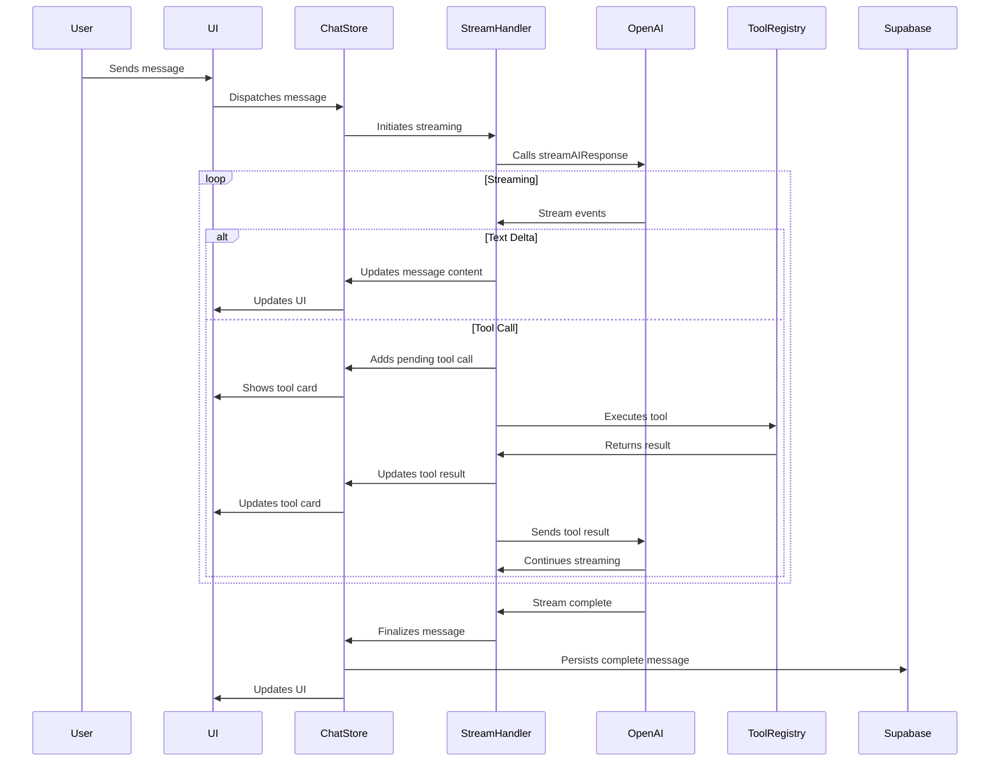

# Streaming Implementation with OpenAI Responses API

## Overview

This document details the implementation of streaming AI responses using OpenAI's Responses API. We handle both text streaming and tool calls through a unified message processing engine that maintains conversation state and manages tool execution.

## OpenAI Responses API Integration

The Responses API replaces the legacy Chat Completions API with a more powerful and flexible interface. Key differences include:

1. **Input Format**: Uses `input` array instead of `messages`
2. **Role Types**: Uses 'developer' instead of 'system'
3. **Function Calling**: Enhanced tool definition and output handling
4. **Streaming**: Semantic event types for finer-grained control
5. **State Management**: Built-in conversation state tracking

## Implementation

### API Client Configuration

```typescript
// src/lib/ai/openai-client.ts
import { OpenAI } from 'openai';

// Initialize with environment variables
const openai = new OpenAI({
  apiKey: process.env.OPENAI_API_KEY
});

export interface ResponsesAPIInput {
  role: 'user' | 'assistant' | 'developer';
  content: string;
  name?: string;
}

export interface FunctionOutput {
  type: 'function_call_output';
  call_id: string;
  output: string;
}

export interface AIRequestOptions {
  input: ResponsesAPIInput[] | FunctionOutput[];
  tools?: Array<{
    type: "function";
    name: string;
    description: string;
    parameters: Record<string, any>;
    strict: boolean;
  }>;
  stream?: boolean;
  model?: string;
  store?: boolean;
  previous_response_id?: string;
}

// Non-streaming request
export async function sendAIRequest(options: AIRequestOptions) {
  return openai.responses.create({
    model: options.model || 'gpt-4o-mini',
    input: options.input,
    tools: options.tools,
    stream: options.stream || false,
    store: options.store || false,
    previous_response_id: options.previous_response_id
  });
}

// Streaming request
export async function* streamAIResponse(options: AIRequestOptions) {
  return openai.responses.create({
    model: options.model || 'gpt-4o-mini',
    input: options.input,
    tools: options.tools,
    stream: true,
    store: options.store || false,
    previous_response_id: options.previous_response_id
  });
}
```

### Streaming Event Handling

```typescript
// src/types/chat.ts
export interface OpenAIStreamEvent {
  type: string;
  [key: string]: any;
}

export interface TextDeltaEvent {
  type: "response.output_text.delta";
  delta: {
    text: string;
  };
}

export interface ToolCallAddedEvent {
  type: "response.output_item.added";
  item: {
    type: "function_call";
    id: string;
    call_id: string;
    name: string;
    arguments: string;
  };
}

export interface StreamCompleteEvent {
  type: "response.complete";
  responseId: string;
}

export type OpenAIStreamEvent = TextDeltaEvent | ToolCallAddedEvent | StreamCompleteEvent;
```

### Message Streaming Implementation

```typescript
// src/lib/ai/stream-handler.ts
import { useSessionChatStore } from '../../store/session-chat-store';
import { OpenAIStreamEvent, ChatMessage, ToolCall } from '../../types/chat';
import { streamAIResponse, sendAIRequest } from './openai-client';
import { executeToolWithRetry } from './tool-helpers';

export interface StreamOptions {
  sessionId: string;
  userMessage: string;
  assistantMessageId: string;
  developerInstructions: string;
  previousMessages: ChatMessage[];
  tools: any[];
}

export async function handleMessageStream(options: StreamOptions) {
  const store = useSessionChatStore.getState();
  const {
    sessionId,
    userMessage,
    assistantMessageId,
    developerInstructions,
    previousMessages,
    tools
  } = options;
  
  try {
    // 1. Prepare input for OpenAI Responses API
    const inputMessages = [
      { role: 'developer', content: developerInstructions },
      ...previousMessages.map(msg => ({
        role: msg.role as 'user' | 'assistant',
        content: msg.content
      })),
      { role: 'user', content: userMessage }
    ];
    
    // 2. Start streaming response
    const stream = await streamAIResponse({
      input: inputMessages,
      tools: tools,
      store: true, // Enable state management
      model: 'gpt-4o-mini'
    });
    
    let responseId: string | undefined;
    
    // 3. Process stream events
    for await (const event of stream) {
      if (!responseId && 'responseId' in stream) {
        responseId = stream.responseId;
        // Store response ID in our message metadata
        store.updateStreamingMessage(assistantMessageId, {
          processingMetadata: {
            ...store.getMessageById(assistantMessageId)?.processingMetadata,
            responseId: responseId
          }
        });
      }
      
      await processStreamEvent(event, {
        sessionId,
        assistantMessageId,
        responseId
      });
    }
    
    // 4. Finalize message
    store.finalizeStreamingMessage(assistantMessageId);
    
    return {
      success: true,
      responseId
    };
  } catch (error) {
    console.error('Streaming error:', error);
    
    // Update message with error
    store.updateStreamingMessage(assistantMessageId, {
      content: store.getMessageById(assistantMessageId)?.content + 
               "\n\nI'm sorry, I encountered an error. Please try again.",
      streamingStatus: {
        isStreaming: false,
        error: error.message
      }
    });
    
    return {
      success: false,
      error
    };
  }
}

async function processStreamEvent(
  event: OpenAIStreamEvent,
  context: {
    sessionId: string;
    assistantMessageId: string;
    responseId?: string;
  }
) {
  const store = useSessionChatStore.getState();
  const { assistantMessageId, responseId } = context;
  
  switch (event.type) {
    case "response.output_text.delta":
      // Update message content with text delta
      store.updateStreamingMessage(assistantMessageId, {
        content: (store.getMessageById(assistantMessageId)?.content || '') + 
                 event.delta.text
      });
      break;
      
    case "response.output_item.added":
      if (event.item?.type === "function_call") {
        // Process tool call
        await handleToolCall(
          event.item,
          assistantMessageId,
          responseId
        );
      }
      break;
      
    case "response.complete":
      // Stream complete, but we'll let the outer function handle finalization
      break;
      
    default:
      // Handle other event types if needed
      console.log('Unhandled stream event type:', event.type);
  }
}

async function handleToolCall(
  toolCall: any,
  messageId: string,
  responseId?: string
) {
  const store = useSessionChatStore.getState();
  
  try {
    // 1. Parse arguments
    const toolArgs = JSON.parse(toolCall.arguments);
    
    // 2. Add tool call to message
    store.updateStreamingMessage(messageId, {
      toolCalls: [
        ...(store.getMessageById(messageId)?.toolCalls || []),
        {
          id: toolCall.id,
          name: toolCall.name,
          arguments: toolCall.arguments,
          status: 'pending'
        }
      ]
    });
    
    // 3. Execute tool
    const result = await executeToolWithRetry(
      toolCall.name,
      toolArgs
    );
    
    // 4. Update tool call with result
    store.updateToolCall(messageId, toolCall.id, {
      output: result,
      status: 'complete'
    });
    
    // 5. Send result back to OpenAI if we have a responseId
    if (responseId) {
      await sendAIRequest({
        previous_response_id: responseId,
        input: [{
          type: 'function_call_output',
          call_id: toolCall.call_id,
          output: JSON.stringify(result)
        }]
      });
    }
  } catch (error) {
    console.error(`Tool execution error (${toolCall.name}):`, error);
    
    // Update tool call with error
    store.updateToolCall(messageId, toolCall.id, {
      error: error.message,
      status: 'error'
    });
    
    // Let OpenAI know about the error
    if (responseId) {
      await sendAIRequest({
        previous_response_id: responseId,
        input: [{
          type: 'function_call_output',
          call_id: toolCall.call_id,
          output: JSON.stringify({ error: error.message })
        }]
      });
    }
  }
}
```

## Message Processing Flow



## Tool Streaming Details

When a tool call is made during streaming:

1. **Event Detection**: We receive a `response.output_item.added` event
2. **Tool Execution**: The tool is executed with the provided arguments
3. **UI Update**: The UI shows a pending tool card, then updates with results
4. **Continuation**: The result is sent back to OpenAI to continue the response
5. **Integration**: The AI incorporates the tool results into its response

## Tool Call Visualization

During streaming, tool calls are visualized in real-time:

1. **Pending State**: Tool card appears with loading indicator
2. **Execution**: Tool runs in background while streaming continues
3. **Result Display**: Card updates with results while AI continues to respond
4. **Interactive Elements**: User can interact with and modify tool parameters

## Error Handling

We implement robust error handling for streaming:

1. **Connection Issues**: Detect and recover from network interruptions
2. **Tool Execution Errors**: Properly handle and display tool failures
3. **Response Errors**: Gracefully handle API errors
4. **Retry Logic**: Implement appropriate retries for transient failures

```typescript
// Example of streaming error handling
try {
  // Streaming code
} catch (error) {
  if (error.name === 'AbortError') {
    // Handle user-initiated cancellation
  } else if (error.status === 429) {
    // Handle rate limiting
  } else if (error.message.includes('network')) {
    // Handle network errors
  } else {
    // Handle other errors
  }
  
  // Update UI to show error state
  store.updateStreamingMessage(messageId, {
    streamingStatus: { 
      isStreaming: false, 
      error: formatErrorForUser(error)
    }
  });
}
```

## Rate Limiting

To avoid API rate limits, we implement:

1. **Token Bucket**: Track available tokens with refill rate
2. **Queuing**: Queue requests when approaching limits
3. **Backoff**: Implement exponential backoff for retries
4. **User Feedback**: Show appropriate UI during rate limiting

```typescript
// src/lib/ai/rate-limiter.ts
class TokenBucket {
  private tokens: number;
  private maxTokens: number;
  private refillRate: number;
  private lastRefill: number;
  
  constructor(maxTokens: number, refillRate: number) {
    this.maxTokens = maxTokens;
    this.tokens = maxTokens;
    this.refillRate = refillRate;
    this.lastRefill = Date.now();
  }
  
  refill() {
    const now = Date.now();
    const elapsed = now - this.lastRefill;
    const tokensToAdd = (elapsed / 1000) * this.refillRate;
    
    this.tokens = Math.min(this.maxTokens, this.tokens + tokensToAdd);
    this.lastRefill = now;
  }
  
  consume(tokens: number): boolean {
    this.refill();
    
    if (this.tokens >= tokens) {
      this.tokens -= tokens;
      return true;
    }
    
    return false;
  }
  
  getWaitTime(tokens: number): number {
    this.refill();
    
    if (this.tokens >= tokens) {
      return 0;
    }
    
    const tokensNeeded = tokens - this.tokens;
    return (tokensNeeded / this.refillRate) * 1000;
  }
}

// Create a rate limiter for our API (for example, 10000 tokens per minute)
const rateLimiter = new TokenBucket(10000, 10000 / 60);

export async function withRateLimit<T>(
  fn: () => Promise<T>,
  tokensRequired: number
): Promise<T> {
  const waitTime = rateLimiter.getWaitTime(tokensRequired);
  
  if (waitTime > 0) {
    console.log(`Rate limit approaching, waiting ${waitTime}ms`);
    await new Promise(resolve => setTimeout(resolve, waitTime));
  }
  
  rateLimiter.consume(tokensRequired);
  return fn();
}
```

## Performance Optimization

To optimize streaming performance:

1. **Chunked Rendering**: Batch UI updates to avoid excessive re-renders
2. **Message Virtualization**: Only render visible messages
3. **Efficient DOM Updates**: Minimize DOM manipulations
4. **Debounced Events**: Debounce rapid stream events

```typescript
// Optimized streaming update
let contentBuffer = '';
let lastUpdateTime = 0;

for await (const event of stream) {
  if (event.type === "response.output_text.delta") {
    // Accumulate text in buffer
    contentBuffer += event.delta.text;
    
    const now = Date.now();
    // Only update UI every 50ms to avoid excessive re-renders
    if (now - lastUpdateTime > 50) {
      store.updateStreamingMessage(messageId, {
        content: (store.getMessageById(messageId)?.content || '') + contentBuffer
      });
      contentBuffer = '';
      lastUpdateTime = now;
    }
  }
  // Process other events immediately
  else {
    // If there's buffered content, flush it first
    if (contentBuffer) {
      store.updateStreamingMessage(messageId, {
        content: (store.getMessageById(messageId)?.content || '') + contentBuffer
      });
      contentBuffer = '';
    }
    
    // Handle other event types
    await processStreamEvent(event, context);
  }
}

// Ensure any remaining buffered content is flushed
if (contentBuffer) {
  store.updateStreamingMessage(messageId, {
    content: (store.getMessageById(messageId)?.content || '') + contentBuffer
  });
}
```

## Streaming Component Integration

```tsx
// src/components/chat/ChatStream.tsx
import { useEffect, useState } from 'react';
import { useSessionChatStore } from '../../store/session-chat-store';
import { handleMessageStream } from '../../lib/ai/stream-handler';
import { toolRegistry } from '../../lib/ai/tool-registry';
import { TRAVEL_ASSISTANT_INSTRUCTIONS } from '../../lib/ai/prompts';

export const ChatStream: React.FC<{
  sessionId: string;
  messageLimit?: number;
}> = ({ sessionId, messageLimit = 15 }) => {
  const [isProcessing, setIsProcessing] = useState(false);
  const [error, setError] = useState<string | null>(null);
  
  const {
    messages,
    addUserMessage,
    addStreamingMessage,
    getRecentMessages,
    currentUser
  } = useSessionChatStore();
  
  const handleSendMessage = async (userMessage: string) => {
    if (!userMessage.trim() || isProcessing) return;
    
    setIsProcessing(true);
    setError(null);
    
    try {
      // 1. Add user message
      await addUserMessage({
        session_id: sessionId,
        content: userMessage,
        role: 'user',
        user_id: currentUser?.id,
        timestamp: new Date().toISOString()
      });
      
      // 2. Create placeholder for assistant message
      const assistantMessageId = `msg_${Date.now()}`;
      addStreamingMessage({
        id: assistantMessageId,
        session_id: sessionId,
        content: '',
        role: 'assistant',
        timestamp: new Date().toISOString(),
        streamingStatus: { isStreaming: true }
      });
      
      // 3. Get recent messages for context
      const recentMessages = getRecentMessages(sessionId, messageLimit);
      
      // 4. Start streaming
      const result = await handleMessageStream({
        sessionId,
        userMessage,
        assistantMessageId,
        developerInstructions: TRAVEL_ASSISTANT_INSTRUCTIONS,
        previousMessages: recentMessages,
        tools: toolRegistry.getAllDefinitions()
      });
      
      if (!result.success) {
        throw result.error;
      }
    } catch (err) {
      console.error('Chat error:', err);
      setError('Failed to process message. Please try again.');
    } finally {
      setIsProcessing(false);
    }
  };
  
  return (
    // Chat interface implementation
    // ...
  );
};
```

## Testing Streaming Implementation

```typescript
// src/lib/ai/__tests__/stream-handler.test.ts
import { handleMessageStream } from '../stream-handler';
import { streamAIResponse } from '../openai-client';
import { executeToolWithRetry } from '../tool-helpers';
import { useSessionChatStore } from '../../../store/session-chat-store';

// Mock dependencies
jest.mock('../openai-client');
jest.mock('../tool-helpers');
jest.mock('../../../store/session-chat-store');

describe('Stream Handler', () => {
  beforeEach(() => {
    jest.resetAllMocks();
    
    // Mock store
    (useSessionChatStore.getState as jest.Mock).mockReturnValue({
      updateStreamingMessage: jest.fn(),
      finalizeStreamingMessage: jest.fn(),
      updateToolCall: jest.fn(),
      getMessageById: jest.fn().mockReturnValue({
        content: '',
        toolCalls: []
      })
    });
  });
  
  it('processes text delta events', async () => {
    // Setup stream mock
    const mockStream = {
      [Symbol.asyncIterator]: async function* () {
        yield { type: 'response.output_text.delta', delta: { text: 'Hello' } };
        yield { type: 'response.output_text.delta', delta: { text: ' world' } };
        yield { type: 'response.complete' };
      },
      responseId: 'resp_123'
    };
    
    (streamAIResponse as jest.Mock).mockResolvedValue(mockStream);
    
    // Execute
    await handleMessageStream({
      sessionId: 'session_123',
      userMessage: 'Hi',
      assistantMessageId: 'msg_123',
      developerInstructions: 'You are a helpful assistant',
      previousMessages: [],
      tools: []
    });
    
    // Verify
    const store = useSessionChatStore.getState();
    expect(store.updateStreamingMessage).toHaveBeenCalledWith('msg_123', {
      content: 'Hello'
    });
    expect(store.updateStreamingMessage).toHaveBeenCalledWith('msg_123', {
      content: 'Hello world'
    });
    expect(store.finalizeStreamingMessage).toHaveBeenCalledWith('msg_123');
  });
  
  it('processes tool call events', async () => {
    // Setup tool call event mock
    const mockToolCall = {
      type: 'function_call',
      id: 'tool_123',
      call_id: 'call_123',
      name: 'search_flights',
      arguments: JSON.stringify({
        origin: 'JFK',
        destination: 'LAX',
        departureDate: '2025-06-01'
      })
    };
    
    const mockToolResult = {
      success: true,
      offers: [/* mock flight data */]
    };
    
    // Setup stream mock
    const mockStream = {
      [Symbol.asyncIterator]: async function* () {
        yield { 
          type: 'response.output_item.added', 
          item: mockToolCall
        };
        yield { type: 'response.complete' };
      },
      responseId: 'resp_123'
    };
    
    (streamAIResponse as jest.Mock).mockResolvedValue(mockStream);
    (executeToolWithRetry as jest.Mock).mockResolvedValue(mockToolResult);
    
    // Execute
    await handleMessageStream({
      sessionId: 'session_123',
      userMessage: 'Find flights from JFK to LAX',
      assistantMessageId: 'msg_123',
      developerInstructions: 'You are a helpful assistant',
      previousMessages: [],
      tools: [{
        type: 'function',
        name: 'search_flights',
        description: 'Search for flights',
        parameters: {}
      }]
    });
    
    // Verify
    const store = useSessionChatStore.getState();
    expect(store.updateStreamingMessage).toHaveBeenCalledWith('msg_123', {
      toolCalls: [{
        id: 'tool_123',
        name: 'search_flights',
        arguments: expect.any(String),
        status: 'pending'
      }]
    });
    
    expect(executeToolWithRetry).toHaveBeenCalledWith(
      'search_flights',
      expect.objectContaining({
        origin: 'JFK',
        destination: 'LAX'
      })
    );
    
    expect(store.updateToolCall).toHaveBeenCalledWith(
      'msg_123',
      'tool_123',
      expect.objectContaining({
        output: mockToolResult,
        status: 'complete'
      })
    );
  });
});
```
