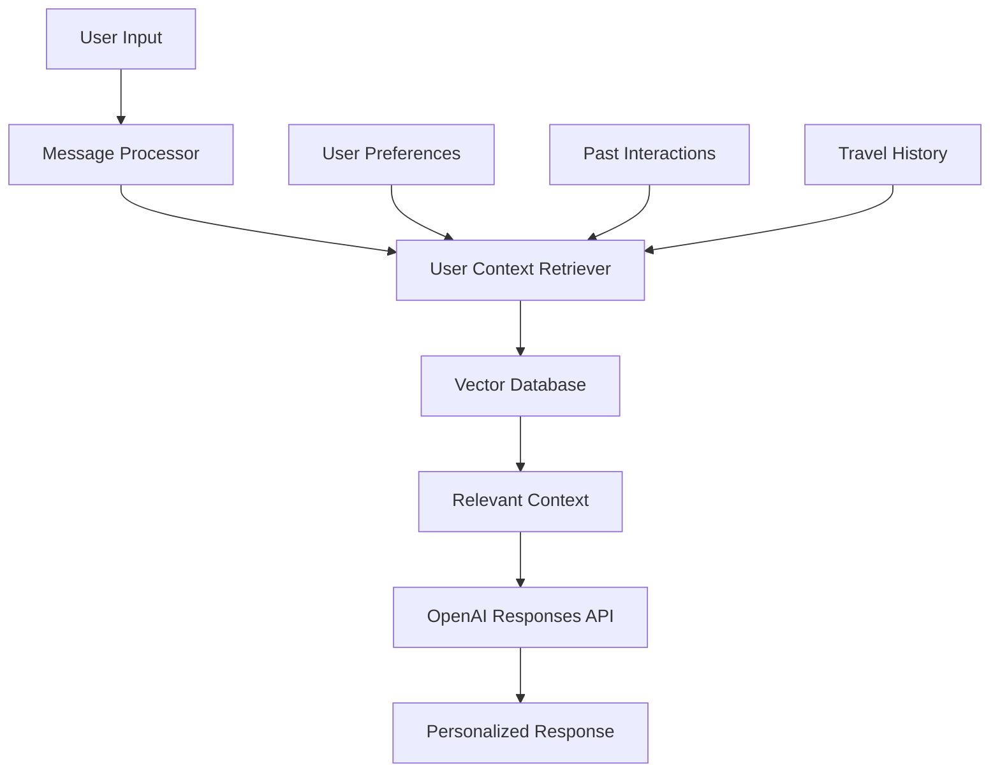

# User Personalization

## Overview

Sword Travel implements a RAG-based (Retrieval-Augmented Generation) system to personalize the AI assistant's responses based on user preferences and past interactions. This system enhances the quality of recommendations and improves the user experience by providing contextually relevant information.

## Personalization Architecture



## User Preference Storage

User preferences are stored in Supabase with the following schema:

```typescript
// src/types/preferences.ts
export interface TravelPreferences {
  preferredAirlines: string[];
  preferredCabinClass: 'economy' | 'premium_economy' | 'business' | 'first';
  preferredHotelChains: string[];
  dietaryRestrictions: string[];
  accessibilityNeeds: string[];
  budgetPreferences: {
    flights: 'economy' | 'moderate' | 'premium' | 'luxury';
    accommodations: 'budget' | 'moderate' | 'upscale' | 'luxury';
    activities: 'free' | 'budget' | 'moderate' | 'premium';
  };
  travelInterests: string[];
  travelStyle: string[];
  seasonalPreferences: {
    winter: boolean;
    spring: boolean;
    summer: boolean;
    fall: boolean;
  };
}

export interface UIPreferences {
  theme: 'light' | 'dark' | 'system';
  language: string;
  notifications: {
    email: boolean;
    push: boolean;
    sms: boolean;
  };
  displayCurrency: string;
  resultsPerPage: number;
}

export interface UserPreferences {
  travel: TravelPreferences;
  ui: UIPreferences;
  created_at: string;
  updated_at: string;
}
```

## RAG Implementation

We use a combination of embedding-based retrieval and structured preference data:

```typescript
// src/lib/ai/personalization/embeddings.ts
import { OpenAI } from 'openai';
import { supabase } from '../../supabase';

const openai = new OpenAI({
  apiKey: process.env.OPENAI_API_KEY
});

// Generate embeddings for user preferences
export async function generatePreferenceEmbeddings(
  userId: string,
  preferences: any
): Promise<number[]> {
  // Convert preferences to a descriptive string
  const preferenceString = Object.entries(preferences)
    .map(([key, value]) => {
      if (typeof value === 'object') {
        return `${key}: ${JSON.stringify(value)}`;
      }
      return `${key}: ${value}`;
    })
    .join('\n');
    
  // Generate embedding using OpenAI
  const response = await openai.embeddings.create({
    model: "text-embedding-ada-002",
    input: preferenceString
  });
  
  return response.data[0].embedding;
}

// Store embeddings in Supabase
export async function storePreferenceEmbeddings(
  userId: string,
  embedding: number[]
): Promise<void> {
  const { error } = await supabase
    .from('user_preference_embeddings')
    .upsert({
      user_id: userId,
      embedding,
      updated_at: new Date().toISOString()
    });
    
  if (error) {
    throw new Error(`Failed to store embeddings: ${error.message}`);
  }
}

// Update embeddings when preferences change
export async function updatePreferenceEmbeddings(
  userId: string,
  preferences: any
): Promise<void> {
  const embedding = await generatePreferenceEmbeddings(userId, preferences);
  await storePreferenceEmbeddings(userId, embedding);
}
```

## Context Retrieval

```typescript
// src/lib/ai/personalization/context-retriever.ts
import { supabase } from '../../supabase';
import { TravelPreferences } from '../../../types/preferences';

export interface UserContext {
  preferences: TravelPreferences;
  recentSearches: Array<{
    type: 'flight' | 'hotel';
    parameters: any;
    timestamp: string;
  }>;
  pastTrips: Array<{
    destination: string;
    dates: {
      start: string;
      end: string;
    };
    type: string;
  }>;
}

// Retrieve user context
export async function getUserContext(userId: string): Promise<UserContext | null> {
  if (!userId) return null;
  
  try {
    // Get user preferences
    const { data: preferencesData, error: preferencesError } = await supabase
      .from('user_preferences')
      .select('travel_preferences')
      .eq('user_id', userId)
      .single();
      
    if (preferencesError) throw preferencesError;
    
    // Get recent searches (last 5)
    const { data: searchesData, error: searchesError } = await supabase
      .from('user_searches')
      .select('type, parameters, created_at')
      .eq('user_id', userId)
      .order('created_at', { ascending: false })
      .limit(5);
      
    if (searchesError) throw searchesError;
    
    // Get past trips
    const { data: tripsData, error: tripsError } = await supabase
      .from('user_trips')
      .select('destination, start_date, end_date, trip_type')
      .eq('user_id', userId)
      .order('start_date', { ascending: false });
      
    if (tripsError) throw tripsError;
    
    return {
      preferences: preferencesData?.travel_preferences || {},
      recentSearches: searchesData?.map(search => ({
        type: search.type,
        parameters: search.parameters,
        timestamp: search.created_at
      })) || [],
      pastTrips: tripsData?.map(trip => ({
        destination: trip.destination,
        dates: {
          start: trip.start_date,
          end: trip.end_date
        },
        type: trip.trip_type
      })) || []
    };
  } catch (error) {
    console.error('Error retrieving user context:', error);
    return null;
  }
}

// Format user context for AI consumption
export function formatUserContextForAI(context: UserContext): string {
  if (!context) return '';
  
  let formattedContext = '## User Preferences\n\n';
  
  // Format travel preferences
  if (context.preferences) {
    formattedContext += 'Travel Preferences:\n';
    
    if (context.preferences.preferredAirlines?.length) {
      formattedContext += `- Preferred Airlines: ${context.preferences.preferredAirlines.join(', ')}\n`;
    }
    
    if (context.preferences.preferredCabinClass) {
      formattedContext += `- Preferred Cabin Class: ${context.preferences.preferredCabinClass}\n`;
    }
    
    if (context.preferences.budgetPreferences) {
      formattedContext += '- Budget Preferences:\n';
      Object.entries(context.preferences.budgetPreferences).forEach(([key, value]) => {
        formattedContext += `  - ${key}: ${value}\n`;
      });
    }
    
    if (context.preferences.travelInterests?.length) {
      formattedContext += `- Travel Interests: ${context.preferences.travelInterests.join(', ')}\n`;
    }
    
    formattedContext += '\n';
  }
  
  // Format recent searches
  if (context.recentSearches?.length) {
    formattedContext += '## Recent Searches\n\n';
    
    context.recentSearches.forEach(search => {
      const date = new Date(search.timestamp).toLocaleDateString();
      
      if (search.type === 'flight') {
        formattedContext += `- Flight (${date}): ${search.parameters.origin} to ${search.parameters.destination}\n`;
      } else if (search.type === 'hotel') {
        formattedContext += `- Hotel (${date}): ${search.parameters.location} from ${search.parameters.checkIn} to ${search.parameters.checkOut}\n`;
      }
    });
    
    formattedContext += '\n';
  }
  
  // Format past trips
  if (context.pastTrips?.length) {
    formattedContext += '## Past Trips\n\n';
    
    context.pastTrips.forEach(trip => {
      formattedContext += `- ${trip.destination} (${trip.type}): ${trip.dates.start} to ${trip.dates.end}\n`;
    });
  }
  
  return formattedContext;
}
```

## Preference Learning

We implement a system to infer user preferences from their interactions:

```typescript
// src/lib/ai/personalization/preference-learner.ts
import { supabase } from '../../supabase';
import { OpenAI } from 'openai';
import { TravelPreferences } from '../../../types/preferences';

const openai = new OpenAI({
  apiKey: process.env.OPENAI_API_KEY
});

// Infer preferences from user actions
export async function inferPreferences(userId: string): Promise<Partial<TravelPreferences>> {
  try {
    // Get user's recent actions
    const { data: flightSearches } = await supabase
      .from('user_searches')
      .select('parameters, created_at')
      .eq('user_id', userId)
      .eq('type', 'flight')
      .order('created_at', { ascending: false })
      .limit(10);
      
    const { data: hotelSearches } = await supabase
      .from('user_searches')
      .select('parameters, created_at')
      .eq('user_id', userId)
      .eq('type', 'hotel')
      .order('created_at', { ascending: false })
      .limit(10);
      
    // Format data for analysis
    const flightData = flightSearches?.map(search => ({
      ...search.parameters,
      timestamp: search.created_at
    })) || [];
    
    const hotelData = hotelSearches?.map(search => ({
      ...search.parameters,
      timestamp: search.created_at
    })) || [];
    
    // Use OpenAI to infer preferences
    const prompt = `
      Based on the following user search history, infer their travel preferences.
      
      Flight searches:
      ${JSON.stringify(flightData, null, 2)}
      
      Hotel searches:
      ${JSON.stringify(hotelData, null, 2)}
      
      Please format the response as a JSON object with these fields:
      - preferredAirlines (array of strings)
      - preferredCabinClass (string)
      - preferredHotelChains (array of strings)
      - budgetPreferences (object with flights, accommodations)
      - travelInterests (array of strings)
      
      Only include fields with strong evidence.
    `;
    
    const response = await openai.responses.create({
      model: "gpt-4o-mini",
      input: [{ role: "user", content: prompt }]
    });
    
    // Parse the AI's response
    try {
      const jsonResponse = JSON.parse(response.output_text);
      return jsonResponse as Partial<TravelPreferences>;
    } catch (e) {
      console.error('Failed to parse AI response:', e);
      return {};
    }
  } catch (error) {
    console.error('Error inferring preferences:', error);
    return {};
  }
}

// Update user preferences with inferred values
export async function updateWithInferredPreferences(userId: string): Promise<void> {
  // Get current preferences
  const { data, error } = await supabase
    .from('user_preferences')
    .select('travel_preferences')
    .eq('user_id', userId)
    .single();
    
  if (error && error.code !== 'PGRST116') { // PGRST116 is "no rows returned"
    throw error;
  }
  
  // Infer new preferences
  const inferredPreferences = await inferPreferences(userId);
  
  // Merge with existing preferences
  const currentPreferences = data?.travel_preferences || {};
  const mergedPreferences = {
    ...currentPreferences,
    ...inferredPreferences,
    // For arrays and objects, merge intelligently
    preferredAirlines: [
      ...(currentPreferences.preferredAirlines || []),
      ...(inferredPreferences.preferredAirlines || [])
    ].filter((v, i, a) => a.indexOf(v) === i), // Remove duplicates
    
    budgetPreferences: {
      ...(currentPreferences.budgetPreferences || {}),
      ...(inferredPreferences.budgetPreferences || {})
    }
  };
  
  // Update in database
  await supabase
    .from('user_preferences')
    .upsert({
      user_id: userId,
      travel_preferences: mergedPreferences,
      updated_at: new Date().toISOString()
    });
    
  // Update embeddings
  await updatePreferenceEmbeddings(userId, mergedPreferences);
}
```

## Integration with AI Requests

We integrate user preferences into AI requests:

```typescript
// src/lib/ai/message-processor.ts
import { getUserContext, formatUserContextForAI } from './personalization/context-retriever';
import { streamAIResponse } from './openai-client';
import { TRAVEL_ASSISTANT_INSTRUCTIONS } from './prompts';

export async function processUserMessage(
  message: string,
  sessionId: string,
  userId: string | null
) {
  // Get user context if available
  let userContext = null;
  if (userId) {
    userContext = await getUserContext(userId);
  }
  
  // Create developer instructions with user context
  let developerInstructions = TRAVEL_ASSISTANT_INSTRUCTIONS;
  
  if (userContext) {
    const formattedContext = formatUserContextForAI(userContext);
    developerInstructions = `${developerInstructions}\n\n${formattedContext}`;
  }
  
  // Stream response with personalized context
  const stream = await streamAIResponse({
    input: [
      { role: 'developer', content: developerInstructions },
      // Include conversation history (implementation omitted)
      { role: 'user', content: message }
    ],
    tools: toolRegistry.getAllDefinitions(),
    store: true
  });
  
  // Process stream events (implementation omitted)
}
```

## User Preference UI

We provide intuitive UI for users to manage their preferences:

```tsx
// src/components/preferences/TravelPreferencesForm.tsx
import { useState, useEffect } from 'react';
import { useForm } from 'react-hook-form';
import { useSessionChatStore } from '../../store/session-chat-store';
import { supabase } from '../../lib/supabase';
import { TravelPreferences } from '../../types/preferences';
import { updatePreferenceEmbeddings } from '../../lib/ai/personalization/embeddings';

export const TravelPreferencesForm: React.FC = () => {
  const currentUser = useSessionChatStore(state => state.currentUser);
  const [loading, setLoading] = useState(false);
  const [success, setSuccess] = useState(false);
  
  const { register, handleSubmit, setValue, watch, formState: { errors } } = useForm<TravelPreferences>();
  
  // Load current preferences
  useEffect(() => {
    if (!currentUser?.id) return;
    
    const loadPreferences = async () => {
      setLoading(true);
      
      try {
        const { data, error } = await supabase
          .from('user_preferences')
          .select('travel_preferences')
          .eq('user_id', currentUser.id)
          .single();
          
        if (error) throw error;
        
        if (data?.travel_preferences) {
          // Set form values
          Object.entries(data.travel_preferences).forEach(([key, value]) => {
            setValue(key as any, value);
          });
        }
      } catch (error) {
        console.error('Error loading preferences:', error);
      } finally {
        setLoading(false);
      }
    };
    
    loadPreferences();
  }, [currentUser?.id, setValue]);
  
  // Save preferences
  const onSubmit = async (data: TravelPreferences) => {
    if (!currentUser?.id) return;
    
    setLoading(true);
    
    try {
      const { error } = await supabase
        .from('user_preferences')
        .upsert({
          user_id: currentUser.id,
          travel_preferences: data,
          updated_at: new Date().toISOString()
        });
        
      if (error) throw error;
      
      // Update embeddings
      await updatePreferenceEmbeddings(currentUser.id, data);
      
      setSuccess(true);
      setTimeout(() => setSuccess(false), 3000);
    } catch (error) {
      console.error('Error saving preferences:', error);
    } finally {
      setLoading(false);
    }
  };
  
  // Form implementation with fields for all preference options
  
  return (
    <form onSubmit={handleSubmit(onSubmit)}>
      {/* Preference form fields */}
    </form>
  );
};
```

## Scheduled Preference Learning

We implement a background process to regularly update user preferences:

```typescript
// src/pages/api/cron/update-preferences.ts
import type { NextApiRequest, NextApiResponse } from 'next';
import { supabase } from '../../../lib/supabase';
import { updateWithInferredPreferences } from '../../../lib/ai/personalization/preference-learner';

// API route for CRON job to update preferences
export default async function handler(
  req: NextApiRequest,
  res: NextApiResponse
) {
  // Verify authorization
  const authHeader = req.headers.authorization;
  if (authHeader !== `Bearer ${process.env.CRON_SECRET}`) {
    return res.status(401).json({ error: 'Unauthorized' });
  }
  
  try {
    // Get active users who haven't had preferences updated in the last week
    const { data: users, error } = await supabase
      .from('user_preferences')
      .select('user_id')
      .lt('updated_at', new Date(Date.now() - 7 * 24 * 60 * 60 * 1000).toISOString());
      
    if (error) throw error;
    
    // Update preferences for each user
    const results = await Promise.allSettled(
      users.map(async (user) => {
        return updateWithInferredPreferences(user.user_id);
      })
    );
    
    // Count successes and failures
    const succeeded = results.filter(r => r.status === 'fulfilled').length;
    const failed = results.filter(r => r.status === 'rejected').length;
    
    return res.status(200).json({
      message: `Updated preferences for ${succeeded} users`,
      failed,
      total: users.length
    });
  } catch (error) {
    console.error('Error in preference update job:', error);
    return res.status(500).json({ error: String(error) });
  }
}
```

## Personalization Metrics

We track metrics to evaluate personalization effectiveness:

```typescript
// src/lib/analytics/personalization-metrics.ts
import { supabase } from '../../lib/supabase';

// Track personalization impact
export async function trackPersonalizationImpact(
  userId: string,
  sessionId: string,
  recommendationAccepted: boolean,
  recommendationType: string
) {
  try {
    await supabase
      .from('personalization_metrics')
      .insert({
        user_id: userId,
        session_id: sessionId,
        recommendation_accepted: recommendationAccepted,
        recommendation_type: recommendationType,
        timestamp: new Date().toISOString()
      });
  } catch (error) {
    console.error('Error tracking personalization metrics:', error);
  }
}

// Calculate acceptance rate
export async function getRecommendationAcceptanceRate(
  userId: string,
  timeframe: 'day' | 'week' | 'month' | 'all' = 'all'
): Promise<number> {
  try {
    let query = supabase
      .from('personalization_metrics')
      .select('recommendation_accepted')
      .eq('user_id', userId);
      
    // Apply timeframe filter
    if (timeframe !== 'all') {
      const cutoff = new Date();
      switch (timeframe) {
        case 'day':
          cutoff.setDate(cutoff.getDate() - 1);
          break;
        case 'week':
          cutoff.setDate(cutoff.getDate() - 7);
          break;
        case 'month':
          cutoff.setMonth(cutoff.getMonth() - 1);
          break;
      }
      
      query = query.gte('timestamp', cutoff.toISOString());
    }
    
    const { data, error } = await query;
    
    if (error) throw error;
    
    if (!data.length) return 0;
    
    const acceptedCount = data.filter(m => m.recommendation_accepted).length;
    return acceptedCount / data.length;
  } catch (error) {
    console.error('Error getting acceptance rate:', error);
    return 0;
  }
}
```

## Privacy Considerations

We implement several privacy measures for user preferences:

1. **Explicit Consent**: Users must opt-in to preference tracking
2. **Granular Control**: Users can delete specific preference types
3. **Data Minimization**: Only store necessary preference data
4. **Automatic Expiry**: Old preference data is automatically pruned
5. **Transparent Access**: Users can view and export all their preference data

```typescript
// src/lib/ai/personalization/privacy-manager.ts
import { supabase } from '../../supabase';

// Delete specific preference categories
export async function deletePreferenceCategory(
  userId: string,
  category: string
): Promise<void> {
  try {
    // Get current preferences
    const { data, error } = await supabase
      .from('user_preferences')
      .select('travel_preferences')
      .eq('user_id', userId)
      .single();
      
    if (error) throw error;
    
    const preferences = data?.travel_preferences || {};
    
    // Remove the specified category
    if (preferences[category]) {
      delete preferences[category];
      
      // Update preferences
      await supabase
        .from('user_preferences')
        .update({
          travel_preferences: preferences,
          updated_at: new Date().toISOString()
        })
        .eq('user_id', userId);
        
      // Update embeddings
      await updatePreferenceEmbeddings(userId, preferences);
    }
  } catch (error) {
    console.error(`Error deleting preference category ${category}:`, error);
    throw error;
  }
}

// Export user preference data
export async function exportUserPreferences(userId: string): Promise<string> {
  try {
    const { data, error } = await supabase
      .from('user_preferences')
      .select('travel_preferences, ui_preferences, created_at, updated_at')
      .eq('user_id', userId)
      .single();
      
    if (error) throw error;
    
    return JSON.stringify(data, null, 2);
  } catch (error) {
    console.error('Error exporting preferences:', error);
    throw error;
  }
}

// Delete all user preference data
export async function deleteAllPreferences(userId: string): Promise<void> {
  try {
    await supabase
      .from('user_preferences')
      .delete()
      .eq('user_id', userId);
      
    await supabase
      .from('user_preference_embeddings')
      .delete()
      .eq('user_id', userId);
      
    await supabase
      .from('user_searches')
      .delete()
      .eq('user_id', userId);
  } catch (error) {
    console.error('Error deleting all preferences:', error);
    throw error;
  }
}
```
